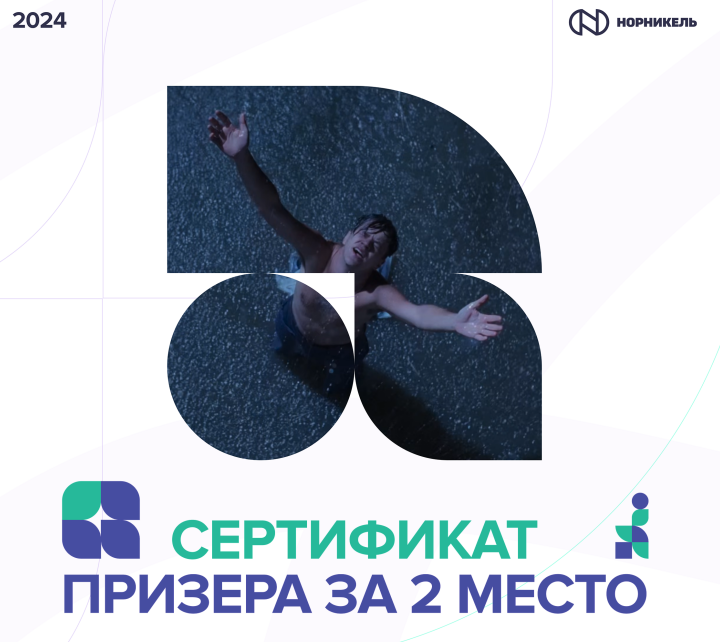

# 🚀 Хакатон: «Интеллектуальные горизонты – Норникель» 🤖  

---

## 📌 Кейс: Определение загрязнения линз камер  

## 🎯 Команда: **Центр искусственного интеллекта СФУ**  

---

<table>
<tr>
<td align="left" width="50%">

### 🥈 Место: **2**  
📍 **Хакатон Норникель 2024 года**  
🔗 [Ссылка на мероприятие](https://nornickel-hackathon.ru/)

### 📖 Описание кейса  
Разработка ИИ-решения для **автоматического определения степени загрязнения линз камер**, что позволит минимизировать влияние загрязнений на работу алгоритмов компьютерного зрения и повысить надежность автоматического контроля в производственных процессах.

### 👥 Участники команды  
- [Константин Кожин](https://github.com/konstantinkozhin) — **Руководитель команды, Data Scientist;**
- [Павел Шерстнев](https://github.com/sherstpasha) — **ML-Enginer;** 
- [Владислава Жуковская](https://github.com/vlada2025) — **Дизайнер;**
- [Алина Нуриманова](https://github.com/ALENKOZAVR) — **Data Analyst.**

</td>
<td align="center" width="50%">

</td>
</tr>
</table>

---

## 📌 Описание решения  

### 🔹 Общая концепция  
Наша система анализирует видеопоток с камер и выявляет **степень загрязнения линз**, что позволяет предотвратить снижение точности работы алгоритмов компьютерного зрения. Для этого мы используем нейросетевую модель, способную **распознавать различные виды загрязнений** (размытость, пятна, засветы, пыль и т. д.).  

### ⚙️ Схема работы системы  
- **Анализ входного изображения**: загрузка и предобработка данных.  
- **Сегментация загрязнений**: использование модели **YOLO11 Nano** для выявления загрязненных областей.  
- **Оценка степени загрязнения**: расчет площади загрязненных участков.  
- **Вывод предсказаний**: визуализация маски загрязнения и уровня покрытия кадра.  
- **Интерактивный Telegram-бот** для демонстрации работы системы.  

---

## 🛠 Технологический стек  
- **Python** — основной язык разработки  
- **NumPy** — обработка числовых данных и массивов  
- **Pandas** — анализ и структурирование табличных данных  
- **OpenCV** — обработка и анализ изображений  
- **Ultralytics** — модели YOLO для компьютерного зрения  
- **PyTorch** — обучение и использование нейросетей  
- **Docker** — контейнеризация приложений для изоляции и удобства развертывания  

---

## 🎥 Screencast (Демонстрация решения)  
Посмотрите, как система анализирует кадры и выявляет загрязнения.  

📌 **[Смотреть видеоролик](Screencast.mp4)**  
